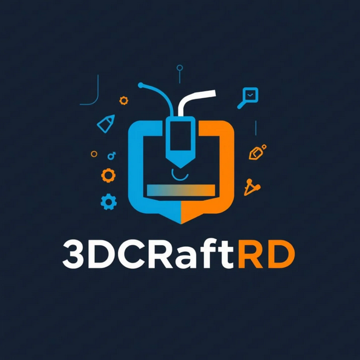

<!DOCTYPE html>
<html lang="es">
<head>
  <meta charset="UTF-8" />
  <meta name="viewport" content="width=device-width, initial-scale=1.0"/>
  <title>Factura 3DCraftRD</title>
  
  
  
  
  
</head>
<body>

  

    

      
      
3DCraftRD

    

    <h1 id="app-title">Factura</h1>
  

  

    <button class="btn-lang" onclick="toggleLang()" id="btn-lang">Toggle Language</button>
    <button class="btn-dashboard" onclick="openDashboard()" id="btn-dashboard">Dashboard</button>
  

  

    

      <label for="customerName" id="lbl-customer-name">Nombre del Cliente</label>
      <input type="text" id="customerName" placeholder="Ingrese el nombre del cliente" list="customersList" />
      <datalist id="customersList"></datalist>
    

    

      <label for="invoiceNumber" id="lbl-invoice-number">Número de Factura</label>
      <input type="text" id="invoiceNumber" readonly />
    

  

  <form id="calculator-form">
    

      

        <label for="filamentType" id="lbl-filament-type">Tipo de Filamento</label>
        <select id="filamentType">
          <option value="1600">PLA (RD$1,600/kg)</option>
          <option value="2000">PETG (RD$2,000/kg)</option>
          <option value="2250">ABS (RD$2,250/kg)</option>
          <option value="2150">ASA (RD$2,150/kg)</option>
          <option value="custom">Personalizado</option>
        </select>

        <label for="filamentPrice" id="lbl-filament-price">Precio del filamento (RD$/kg)</label>
        <input type="number" id="filamentPrice" value="1600" />

        <label for="weight" id="lbl-weight">Peso del modelo (g)</label>
        <input type="number" id="weight" value="150" />

        <label for="electricityPrice" id="lbl-electricity-price">Precio de la electricidad (RD$/kWh)</label>
        <input type="number" step="0.01" id="electricityPrice" value="2.80" />

        <label for="printHours" id="lbl-print-hours">Horas de impresión</label>
        <input type="number" id="printHours" value="6" />
      

      
      

        <label for="laborCost" id="lbl-labor-cost">Mano de obra (RD$)</label>
        <input type="number" id="laborCost" value="150" />

        <label for="otherCosts" id="lbl-other-costs">Otros costos (RD$)</label>
        <input type="number" id="otherCosts" value="100" />

        <label for="maintenanceCost" id="lbl-maintenance-cost">Costo de mantenimiento (RD$)</label>
        <input type="number" id="maintenanceCost" value="50" />

        <label for="printerDepreciation" id="lbl-printer-depreciation">Depreciación de impresora (RD$/hora)</label>
        <input type="number" step="0.01" id="printerDepreciation" value="14.00" />

        <label for="margin" id="lbl-margin">Margen de ganancia (%)</label>
        <input type="number" id="margin" value="40" />

        <label for="exchangeRate" id="lbl-exchange-rate">Tasa de cambio USD a RD$</label>
        <input type="number" id="exchangeRate" value="58.00" />
      

    

  </form>

  
Resultados (Administrador)

  

    
Costo del material: RD$0.00

    
Costo de energía eléctrica: RD$0.00

    
Costo de impresión: RD$0.00

    
Costo de mantenimiento: RD$0.00

    
Costo de mano de obra: RD$0.00

    
Otros costos: RD$0.00

    
Costo total: RD$0.00

    
Precio sugerido: RD$0.00

    
Ganancia neta: RD$0.00

  

  
Detalles de la Factura (Cliente)

  

    
Materiales utilizados: RD$0.00

    
Consumo energético: RD$0.00

    
Tiempo de máquina: RD$0.00

    
Servicio técnico: RD$0.00

    
Precio Total: RD$0.00

  

  

    <button class="btn-export" onclick="exportToPDF()" id="btn-export">Exportar a PDF</button>
    <button class="btn-save" onclick="saveToHistory()" id="btn-save">Guardar en Historial</button>
    <button class="btn-clear" onclick="clearForm()" id="btn-clear">Limpiar Formulario</button>
    <button class="btn-template" onclick="saveTemplate()" id="btn-template">Guardar Plantilla</button>
  

  

    <h3 id="lbl-history">Historial de Impresiones</h3>
    

  

<!-- Modal Dashboard -->

  

    &times;
    <h2 id="lbl-dashboard-title">Dashboard Analytics</h2>
    
    

      <button class="tab active" onclick="openTab(event, 'stats-tab')" id="tab-stats">Estadísticas</button>
      <button class="tab" onclick="openTab(event, 'customers-tab')" id="tab-customers">Clientes</button>
      <button class="tab" onclick="openTab(event, 'templates-tab')" id="tab-templates">Plantillas</button>
    

    
    

      

        

          <h3 id="lbl-monthly-profit">Ganancias Mensuales</h3>
          

            <canvas id="monthlyProfitChart"></canvas>
          

        

        

          <h3 id="lbl-filament-usage">Uso de Filamento</h3>
          

            <canvas id="filamentUsageChart"></canvas>
          

        

      

      

        <h3 id="lbl-recent-activity">Actividad Reciente</h3>
        

      

    

    
    

      <input type="text" id="customerSearch" class="search-box" placeholder="Buscar clientes..." oninput="searchCustomers()" />
      

    

    
    

      <input type="text" id="templateSearch" class="search-box" placeholder="Buscar plantillas..." oninput="searchTemplates()" />
      

    

  

</body>
</html>
